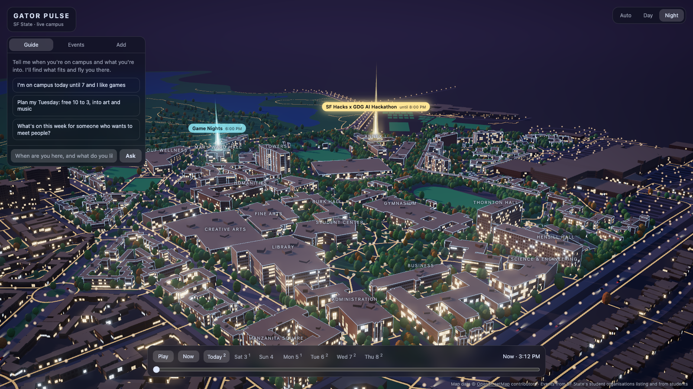
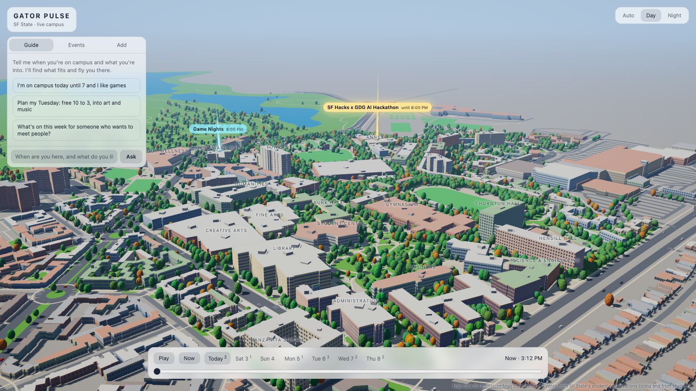

# Gator Pulse

A live 3D map of San Francisco State University where every campus event is a beam of light on
the building it is in. Tell it when you are on campus and what you like, and it shows you what you
can actually make it to.

Built at the SF Hacks x GDG AI Hackathon on 2 October 2026.



## The problem

SF State is a commuter campus, and students say it feels dead and lonely. About twelve of the
hundred most-upvoted posts on r/SFSU over the past year are about not being able to make friends.
One commuter wrote that clubs meet in the late afternoon and evening, after they have already
gone home.

Events do exist. They are scattered across paper flyers and a listing few people open. On the day
this was built, the official student-organisation listing had three events for the whole campus.

## What it does

1. **Shows the campus alive.** Events from SF State's public student-organisation listing appear
   as beacons on a 3D model of the campus. A timeline covers the next seven days, and the lighting
   follows the time of day.
2. **Plans your gaps.** In the Guide tab you say something like "I'm on campus Tuesday 10 to 3 and
   I'm into art and music". Gemini picks events that fit those hours and the map flies you to each
   one.
3. **Turns flyers into beacons.** In the Add tab you choose a photo of a flyer or type a line.
   Gemma 4 reads it into a structured event, you check the draft, and it appears on the map for
   everyone who has the page open.



## The AI in it

| Model | What it does here | Code |
|---|---|---|
| **Gemini 3.5 Flash-Lite** (`gemini-3.5-flash-lite`) | The guide. Reads the student's schedule and interests, chooses from the real upcoming events, and answers through a tool call that also drives the map camera. Falls back to `gemini-3.1-flash-lite`, `gemini-3.7-flash` and `gemini-3.8-flash` if a model is overloaded. | [`server/guide.js`](server/guide.js) |
| **Gemma 4** (`gemma-4-26b-a4b-it`, open weights, called through the Gemini API) | Reads a flyer photo or a typed line into an event, works out which building the place is in, refuses things that are not events, and screens the final wording before it is saved. Falls back to `gemma-4-31b-it`. | [`server/submit.js`](server/submit.js) |

Gemma 4 is an open-weights model from Google, which its documentation lists as released under
Apache 2.0: see the [Gemma documentation](https://ai.google.dev/gemma/docs/core) and the
[licence](https://ai.google.dev/gemma/apache_2). At 26 billion parameters it is a large language
model by this hackathon's definition.

Both models are called with a key from Google AI Studio.

## Run it

You need Node 20 or newer and a Gemini API key from [Google AI Studio](https://aistudio.google.com/apikey).

```
npm install
echo "GEMINI_API_KEY=your-key" > .env
npm run dev
```

Then open http://localhost:5173. Without a key the map and the events still work; the Guide and
Add tabs say they are switched off.

`npm run build` followed by `npm start` serves the built page and the API from one process on
port 8080, which is what a container host such as Cloud Run needs.

`npm run bake` rebuilds `public/campus.json` from OpenStreetMap (it needs Python 3 and `curl`).

## How it is put together

- **`scripts/bake_campus.py`** turns OpenStreetMap buildings, paths and green areas into one data
  file in local metres.
- **`src/`** is the page: three.js draws the campus from that file, with procedural window
  facades, day and night lighting, and decorative cars and people.
- **`server/`** is a small Express server. It fetches SF State's events listing, matches each
  free-text location to a building, and holds the two model integrations.
- New events reach every open page over a server-sent event stream.

## Being careful with it

- **A person checks what the model read.** Gemma's draft is shown as an editable form, with a list
  of anything it was unsure about, and nothing is saved until the student confirms it.
- **Submissions are screened twice:** once when read, and again on the final wording, since the
  student may have edited it.
- **The guide only recommends real events.** It is given the actual listing, and any step that
  names an event which does not exist is dropped.
- **Photos are not stored.** Only the extracted text is kept.
- **The free tier of the Gemini API is used,** on which Google may use submitted content to improve
  its products. A real deployment should use a paid tier.
- **The moving cars and people are decoration.** Their positions are random, not real traffic.
- **Known limits.** There is no sign-in yet, so anyone can submit; a deployment at SF State would
  restrict posting to university accounts. Student events are kept in a file on the server.
  Building heights that OpenStreetMap lacks are estimates.

## Who at SF State this is for

Commuter students who have a few hours between classes and no easy way to see what is on, and the
student organisations whose events nobody finds. The university could run it from the events
listing it already has, with flyer submissions restricted to SF State accounts.

## Data and licences

- Code: MIT, see [`LICENSE`](LICENSE).
- Map data © [OpenStreetMap](https://www.openstreetmap.org/copyright) contributors, under the Open
  Database License.
- Events come from SF State's public student-organisation listing at `sfsu.campuslabs.com`.
- Built with [three.js](https://threejs.org) (MIT), [Express](https://expressjs.com) (MIT) and
  Google's [`@google/genai`](https://www.npmjs.com/package/@google/genai) SDK (Apache 2.0).
